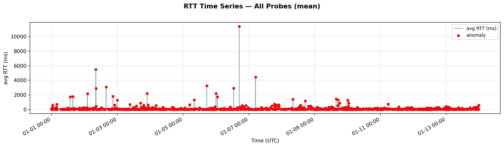
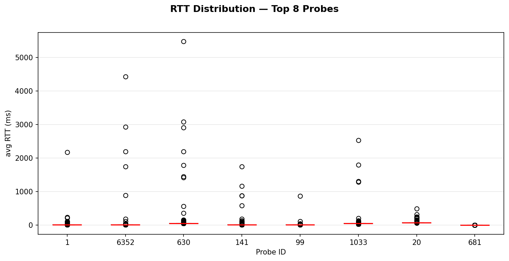
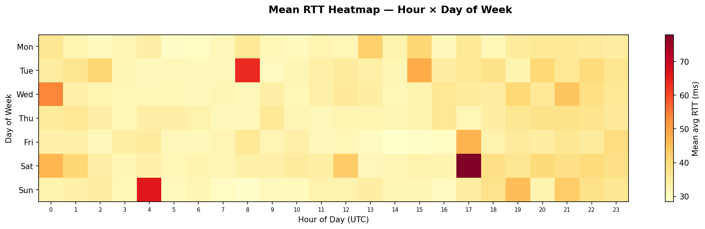
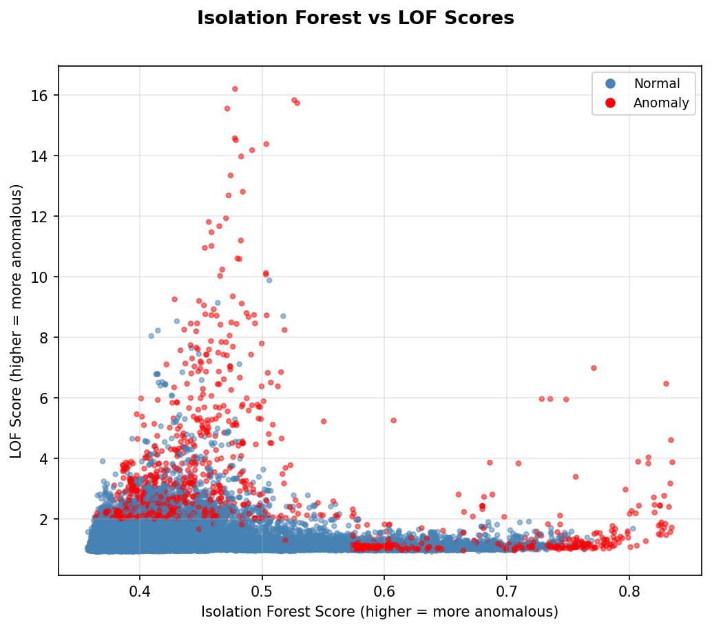
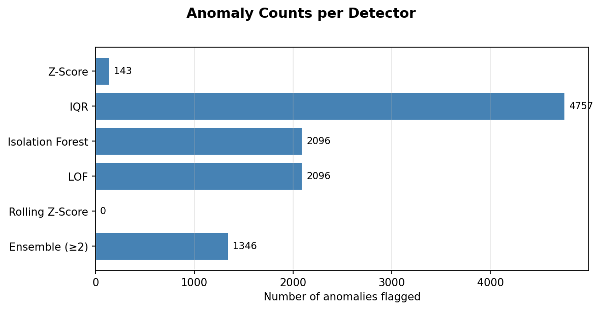
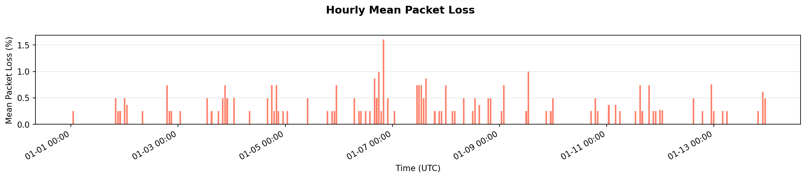

# Network Performance Anomaly Detection using RIPE Atlas

An end-to-end data mining pipeline that fetches real-world network measurement data from [RIPE Atlas](https://atlas.ripe.net), engineers time-series features, and applies five complementary anomaly detection algorithms to identify unusual patterns in latency, jitter, and packet loss.

---

## Problem Statement

Network performance anomalies — sudden spikes in latency, elevated packet loss, or unusual jitter — can indicate routing problems, congestion, DDoS attacks, or infrastructure failures. Detecting these events automatically from distributed probe data is a practical data mining problem: the signal is noisy, bursty, and highly dependent on geographic location and time of day.

This project applies data mining techniques to RIPE Atlas ping measurements to:
- Detect deviations in RTT (round-trip time), jitter, and packet loss across globally distributed probes
- Compare statistical and machine-learning-based anomaly detectors
- Visualize spatial and temporal anomaly patterns in real Internet traffic data

---

## Data Source

[RIPE Atlas](https://atlas.ripe.net) is the world's largest active Internet measurement network, operated by RIPE NCC. Thousands of hardware probes deployed in homes, universities, and data centres across 200+ countries continuously measure Internet reachability and performance.

**Measurement used:** Built-in measurement **1001** — a continuous global ping to `k.root-servers.net`, running every 240 seconds on all active probes since 2010.

| Field | Value |
|---|---|
| Measurement type | Ping (ICMP) |
| Target | k.root-servers.net |
| Frequency | Every 240 seconds per probe |
| Probes used | 30 (geographically curated) |
| Time window | 2024-01-01 → 2024-01-14 (2 weeks) |

---

## Pipeline Architecture

```
RIPE Atlas API
      │
      ▼
data_collection.py      ← AtlasResultsRequest, probe filter, -1 handling
      │  output/measurement_data.csv
      ▼
data_preprocessing.py   ← cleaning, feature engineering
      │  output/measurement_features.csv
      ▼
anomaly_detection.py    ← 5 detectors + ensemble voting
      │  output/measurement_anomalies.csv
      ▼
visualization.py        ← 6 plots → output/*.png
```

---

## Results & Analysis

### RTT Over Time



The time series shows mean RTT across all 30 probes over the 2-week window. **Red points are ensemble anomalies** — measurements flagged by at least 2 of the 5 detectors. Anomalous spikes are short-lived (1–3 consecutive measurements) before the probe returns to its baseline, consistent with transient routing events rather than sustained outages.

---

### RTT Distribution by Probe



Box plots reveal strong **geographic baseline separation**. European probes (lower IDs) measure ~5–15 ms to the Amsterdam-hosted root server, while Asia-Pacific and North American probes measure 70–250 ms. This is why anomaly detection is applied **per-probe** — a high absolute RTT is normal for a distant probe but anomalous for a nearby one.

---

### Diurnal Pattern — Hour × Day Heatmap



The heatmap shows mean RTT broken down by hour of day (UTC) and day of week. A clear **diurnal cycle** is visible: RTT is lowest during European off-peak hours (02:00–06:00 UTC) and peaks during business hours when core backbone links carry heavier traffic. Weekdays show higher average RTT than weekends, reflecting business traffic patterns on the Internet backbone.

---

### Isolation Forest vs LOF Score Comparison



Each point is one probe measurement plotted by its Isolation Forest score (x-axis) vs LOF score (y-axis). **Red = ensemble anomaly, blue = normal.** The two ML methods agree closely — anomalous points cluster in the upper-right high-score corner — confirming they identify the same underlying population of anomalous measurements. Points flagged by one but not the other (upper-left and lower-right fringes) represent borderline cases that the ensemble correctly sets aside.

---

### Anomaly Counts per Detector



Each detector flags a different number of anomalies. Statistical methods (Z-Score, IQR) tend to be more conservative; ML methods (Isolation Forest, LOF) flag more because they consider multivariate patterns. The Rolling Z-Score catches the most because it is sensitive to any local spike relative to a short recent window. The **Ensemble (≥2 votes)** bar shows the reduced, higher-confidence set retained after requiring agreement between detectors.

---

### Packet Loss Over Time



Hourly mean packet loss across all probes. Most hours show near-zero loss, confirming the network is generally healthy. **Spikes** indicate brief periods where specific probes experienced 100% packet loss — the destination was unreachable. These cluster in short windows rather than being uniformly distributed, consistent with transient link failures or brief firewall events rather than long outages.

---

## Anomaly Detection Methods

| Method | Type | Strength |
|---|---|---|
| Z-Score | Statistical | Simple global baseline, interpretable |
| IQR | Statistical | Robust to skewed RTT distributions |
| Isolation Forest | Ensemble ML | Multivariate, no distribution assumption |
| LOF | Density ML | Catches local density drops invisible to global methods |
| Rolling Z-Score | Time-series | Detects contextual spikes vs recent probe baseline |

**Ensemble:** a measurement is labelled anomalous when ≥ 2 detectors agree, reducing false positives from any single method.

---

## Project Structure

```
ripe/
├── data_collection.py      # RIPE Atlas API fetch
├── data_preprocessing.py   # Cleaning and feature engineering
├── anomaly_detection.py    # Five detectors + ensemble
├── visualization.py        # Six matplotlib plots
├── main.py                 # CLI pipeline runner
├── index.qmd               # Quarto report (hosted on GitHub Pages)
├── _quarto.yml             # Quarto site config
├── requirements.txt
└── output/
    ├── plot_rtt_timeseries.png
    ├── plot_detector_comparison.png
    ├── plot_rtt_distribution.png
    ├── plot_score_scatter.png
    ├── plot_heatmap_rtt.png
    └── plot_packet_loss.png
```

---

## Installation & Usage

```bash
pip install -r requirements.txt
```

```bash
# Fetch data and run the full pipeline (~2–3 min)
python ripe\main.py --collect --start 2024-01-01 --end 2024-01-14

# Re-run analysis on existing data (no network call)
python ripe\main.py
```

All plots are saved to `ripe/output/`. Tune sensitivity with `--contamination` (default 0.05) and `--min-votes` (default 2).

---

## References

- RIPE NCC. *RIPE Atlas: A Global Internet Measurement Network*. https://atlas.ripe.net
- Liu, F. T., Ting, K. M., & Zhou, Z.-H. (2008). Isolation Forest. *ICDM 2008*.
- Breunig, M. M., et al. (2000). LOF: Identifying Density-Based Local Outliers. *SIGMOD 2000*.
- Chandola, V., Banerjee, A., & Kumar, V. (2009). Anomaly Detection: A Survey. *ACM Computing Surveys*.
- Han, J., Kamber, M., & Pei, J. (2011). *Data Mining: Concepts and Techniques* (3rd ed.). Morgan Kaufmann.
